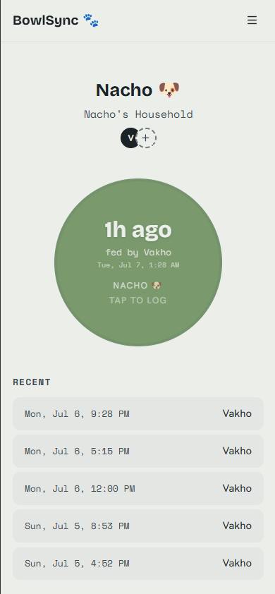

# BowlSync 🐾

One shared answer to "did anyone feed the dog?"

**[Live website - BowlSync](https://bowl-sync.vercel.app)**

<p align="center">
  
</p>

## Why this exists

My roommate and I are raising a puppy named Nacho, and our work schedules barely overlap, so we kept texting each other to check if the dog was fed. Sometimes the answer came late, sometimes it didn't come at all, and more than once Nacho happily ate two dinners because neither of us knew the other had already fed him.

We figured we couldn't be the only household with this problem, so I built BowlSync. It's a page either of us can glance at any time: it shows when the last feeding happened and who did it. Logging a new one takes a single tap, and if a feeding was already logged in the past 30 minutes, the app asks you to confirm before recording another. Most double feedings get caught right there.

## How you use it

- Sign in with an email magic link. There are no passwords.
- Start a household, then share its invite code with everyone who feeds the
  pet. All members write to the same log.
- Log feedings whichever way fits: stick an NFC tag near the bowl and tap your
  phone on it, put a one-tap shortcut on your home screen, or press the button
  in the app. All three open the same `/fed` page.
- The home screen gauge shifts color as time since the last feeding grows, so
  the answer reads from across the room.
- History is filterable by day, week, or a custom range, and any entry can be
  corrected or reassigned after the fact.

## Tech stack

Next.js 16 with server actions, React 19, TypeScript, and
Tailwind CSS v4. Supabase provides magic-link auth and hosted Postgres,
Drizzle ORM owns the schema and queries, Vitest covers the unit-testable
logic, and the whole thing deploys on Vercel.

The stack is intentionally small.Postgres row-level
security runs deny-by-default as a backstop, and every server action scopes
its queries to the signed-in member's household.

## Running locally

You need Node 18+ and a free [Supabase](https://supabase.com) project.

```bash
git clone https://github.com/JellyV/BowlSync.git
cd BowlSync
npm install
cp .env.example .env.local   # fill in the values from your Supabase project
npm run db:migrate           # create tables
npm run db:apply-rls         # enable row-level security
npm run dev
```

Then open [http://localhost:3000](http://localhost:3000).
